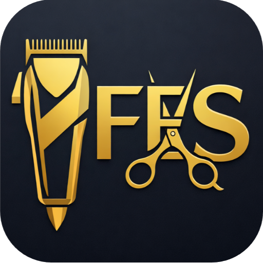
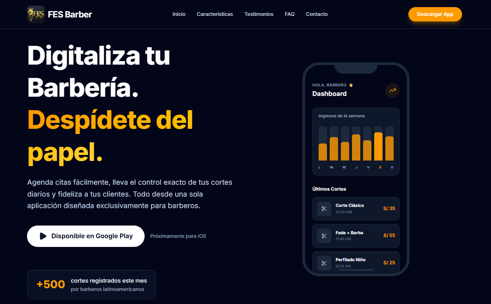
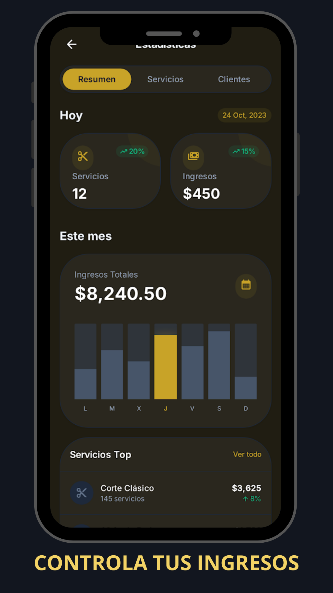

<div align="center">
  
  <h1>FES Barber Landing Page</h1>
  <p><strong>The Ultimate Management SaaS for Modern Barbershops in Latin America ✂️</strong></p>

  <p>
    <a href="https://nextjs.org/"></a>
    <a href="https://tailwindcss.com/"></a>
    <a href="https://www.framer.com/motion/"></a>
    <a href="https://vercel.com/"></a>
  </p>
</div>

---

## 🚀 Overview

**FES Barber** is an innovative SaaS product designed exclusively for barbers in Latin America. It helps professionals seamlessly track their appointments, daily earnings, and client retention—all without relying on outdated paper notebooks.

This repository contains the **official landing page** built to showcase the app's powerful features, display expert testimonials, answer common questions, and drastically improve user conversion rates through a highly optimized sales funnel.

## 🔗 Live Demo
> **[View Live Site 🌍](https://fesbarber.com)** *fesbarber.com*
>
> Download the Android App on Google Play: **[FES Barber on Play Store](https://play.google.com/store/apps/details?id=com.fescore.barber)**

## 💻 Tech Stack

This project is built with modern web development standards to ensure blazing fast performance, top-tier SEO, and stunning animations:

*   **[Next.js (App Router)](https://nextjs.org/)** - React framework for production
*   **[Tailwind CSS](https://tailwindcss.com/)** - Utility-first CSS framework for rapid UI development
*   **[Framer Motion](https://www.framer.com/motion/)** - Production-ready animation library for React
*   **[Lucide React](https://lucide.dev/)** - Beautiful & consistent icon toolkit
*   **[React CountUp](https://github.com/glennreyes/react-countup)** - Animated counter for statistics

## ✨ Key Features

- **📱 Animated Smartphone Mockups:** Fully CSS-rendered devices displaying real-time fake UI animations bridging the gap between web and app.
- **🌗 Permanent Dark Mode:** A sleek, premium dark-slate aesthetic mapped to an amber accent color for max visual contrast.
- **🔄 Sticky Glassmorphism Navigation:** Mobile-first responsive navigation bar with sliding hamburger menus and anchor links.
- **👆 Horizontal Draggable Carousel:** Native-feeling touch-slide testimonials section tailored for mobile UX.
- **📉 High-Converting Funnel Layout:** Structured systematically—Hero → Benefits → Social Proof → FAQ → Final CTA.
- **🌐 Meta Pixel Ready:** Pre-configured placeholders for Facebook/Meta pixel tracking for retargeting campaigns.

## 📸 Screenshots

### 🖥️ Desktop


### 📱 Mobile


## 🛠️ Local Installation

To run this project locally, simply follow these steps:

1. **Clone the repository:**
   ```bash
   git clone [https://github.com/edinsonsan/fes-barber-landing.git](https://github.com/edinsonsan/fes-barber-landing.git)
   cd fes-barber-landing
   ```

2. **Install dependencies:**
   ```bash
   npm install
   # or
   yarn install
   # or
   pnpm install
   ```

3. **Run the development server:**
   ```bash
   npm run dev
   ```

4. **Open in your browser:**
   Navigate to [http://localhost:3000](http://localhost:3000)

## ☁️ Deployment

The easiest way to deploy your Next.js app is to use the [Vercel Platform](https://vercel.com/new?utm_medium=default-template&filter=next.js&utm_source=create-next-app&utm_campaign=create-next-app-readme) from the creators of Next.js.

```bash
npm i -g vercel
vercel
```

## 📂 Project Structure

```text
fes-barber-landing/
├── app/
│   ├── globals.css         # Global Tailwind styles
│   ├── layout.tsx          # Main HTML structure & Meta Pixel wrapper
│   └── page.tsx            # Funnel orchestrator (Home)
├── components/
│   ├── FAQ.tsx             # Dropdown questions natively built
│   ├── Features.tsx        # Value proposition grid
│   ├── FinalCTA.tsx        # Bottom-of-funnel Call to Action
│   ├── Footer.tsx          # Legal anchors & WhatsApp Support
│   ├── Hero.tsx            # Animated mock-up & headline
│   ├── Navbar.tsx          # Responsive router & glass header
│   └── Testimonials.tsx    # Scrollable user feedback
├── public/
│   └── logo.png            # Brand assets
├── tailwind.config.ts      # UI styling configuration
└── package.json            # Dependencies & scripts
```

## 🤝 Contribution

Contributions, issues, and feature requests are welcome! 
Feel free to check the [issues page](https://github.com/edinsonsan/fes-barber-landing/issues).

1. Fork the Project
2. Create your Feature Branch (`git checkout -b feature/AmazingFeature`)
3. Commit your Changes (`git commit -m 'Add some AmazingFeature'`)
4. Push to the Branch (`git push origin feature/AmazingFeature`)
5. Open a Pull Request

## 📄 License

This project is licensed under the **MIT License** - see the [LICENSE](LICENSE) file for details.

---

<div align="center">
  <sub>Built with ❤️ by the FES Core Team.</sub>